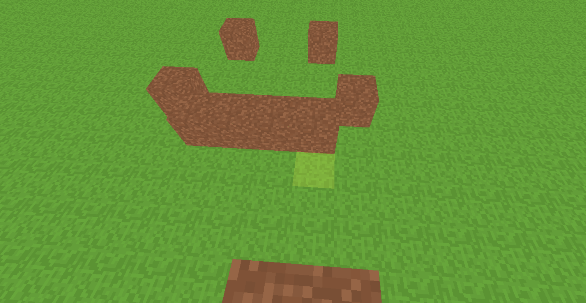

## Features
- Player movement and controls
- Block placement and breaking
- Chunk-based world system
- Basic terrain generation (currently uniform)
- Optimizations (texture atlas, single mesh per chunk)

## Tech Stack
- JavaScript
- Vue
- Three.js

## Known Issues
- Collision and hitboxes are not fully polished
- Occasional stepping bugs
- Visual artifacts (e.g. seeing through textures)
- Movement can sometimes get blocked

## Screenshot

